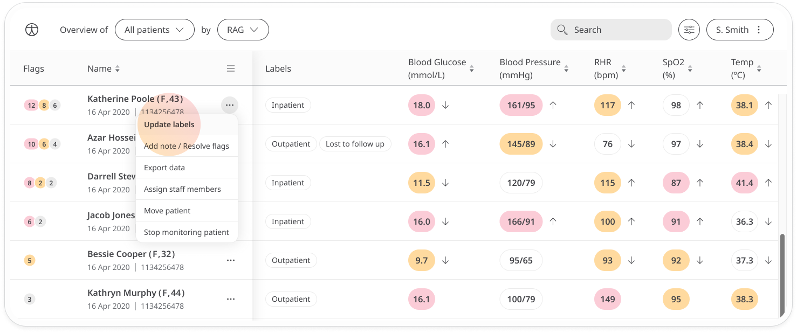
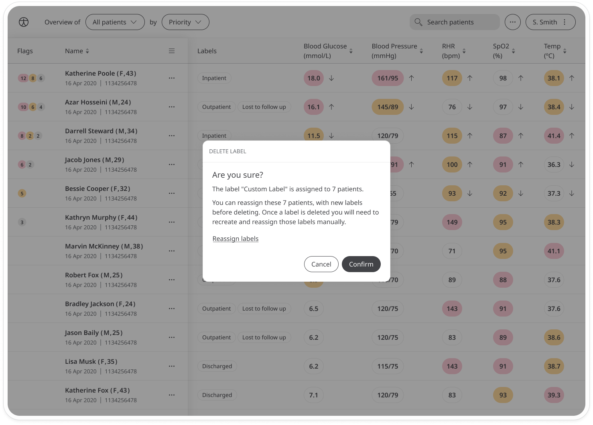
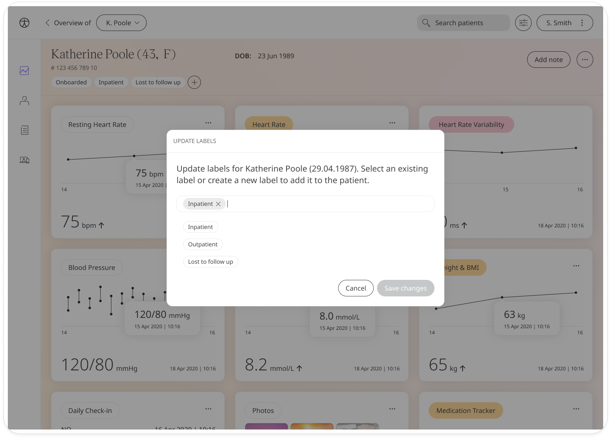

# Patient labels
**User**: Admin; Access Controller; Organisation Staff; 

Patient labels are a way to assess patients based on different criteria depending on their needs. For example, labels can be set based on risk level, patient status, communication channel, etc. is a useful metric to add to help different members of the care team see what is happening with specific patients.

## How it works​
Patient labels can be added manually. First, search for the patient on the patient list, then open the menu at the end of the row and select **Update labels**.

A list will open where you can select an existing label or create a new one.

If you don’t see the label you are looking for, type it in the text field and it will appear as a label below with Create. Just click it to add it to the patient’s labels which you can see in the Labels column. Other users can now select the new label for filtering in order to find specific groups of patients.

You can edit labels for multiple users at a time. Just select all the users you want to assign the label to, then open the patient menu for any of the patients and select **Edit labels**. Select the label you want to add and it will be assigned to all selected patients.

To remove an existing label, click the delete icon. You will see a confirmation message which will ask you if you want to reassign the user or users with a different label. This will help save you time, particularly if you are bulk editing.

You can also edit labels directly on the patient dashboard. Just below the patient name, you will see a list of current labels. Click the + button to open the edit window. From here, you can add, remove or change the order of the existing labels. 

**Related articles**: [Patient List](./patient-list.md); [Icons,languages and labels](../../../admin-portal/managing-deployments/general-settings
/icon-language-and-labels.md) 

