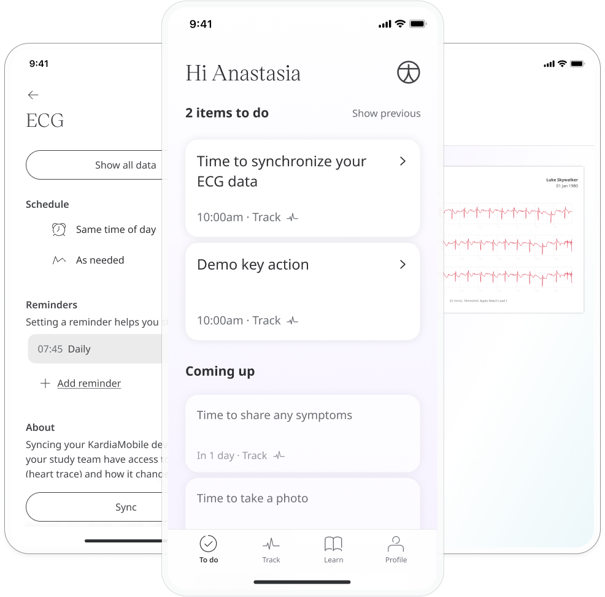
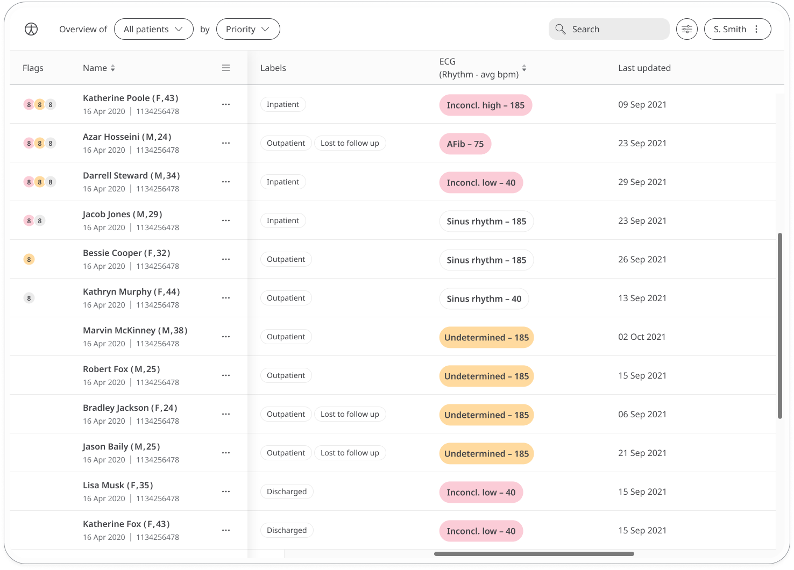
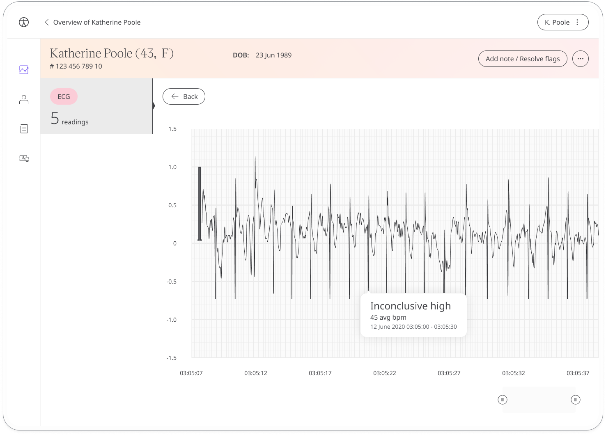

An electrocardiogram (ECG) is often used alongside other tests to help diagnose and monitor conditions affecting the heart. The ECG module records the patient's heart rhythm and electrical activity to look for irregularities.

## How it works
This feature is available to iPhone users with iOS14 or later, or Apple Watch Series 4 or later. Patients open the module and tap on **Sync** to retrieve the data from their Apple Watch or iPhone and sync it with the Huma App. 

Patients can view their historic ECG results in a graph. In the Huma Portal, care teams will be able to easily see the results of the latest ECG readings, recorded as one of the following status and its severity:

- Sinus rhythm
- Atrial fibrillation
- Inconclusive high heart rate
- Inconclusive low heart rate
- Undetermined

The Patient Summary displays a more detailed view of the patient's historic readings in graph or table form.

