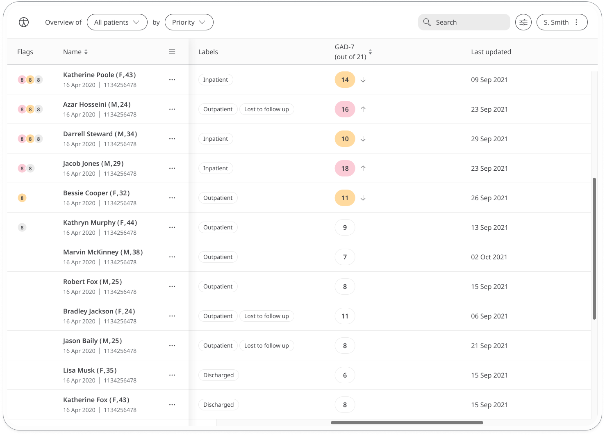
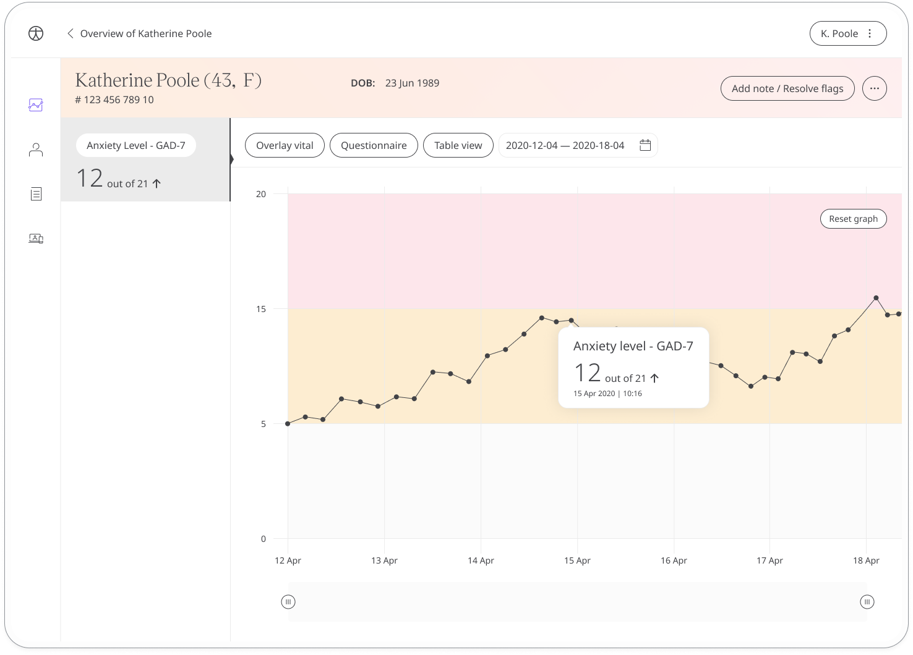

Anxiety is a feeling of unease that can be mild or severe and can have a significant impact on how a person navigates their daily life. The GAD-7 questionnaire screens for and measures the severity of generalised anxiety disorder (GAD). 

## How it works

The GAD-7 questionnaire is a quick and effective anxiety assessment tool for care teams. Patients respond to questions that ask how they have been feeling over the last 2 weeks, such as “How often have you had trouble relaxing?”. They answer from a set of multiple choice options that measure the scale of their anxiety:
- Not at all
- Several days
- More than half the days
- Nearly every day

To start, patients select the GAD-7 module and click **Add**. When they have answered all the questions, they will be assigned a score that is shared with their care team. From within the module, patients can view their progress in a graph and also access all their previous results. Daily, weekly, or monthly reminders can be set to help stay on track.

In the Huma Portal, care teams will see the latest Anxiety Level - GAD-7 score for their patient, with concerning scores flagged for attention. 

In the Patient Summary, care teams can view all historical data in graph or table form.

