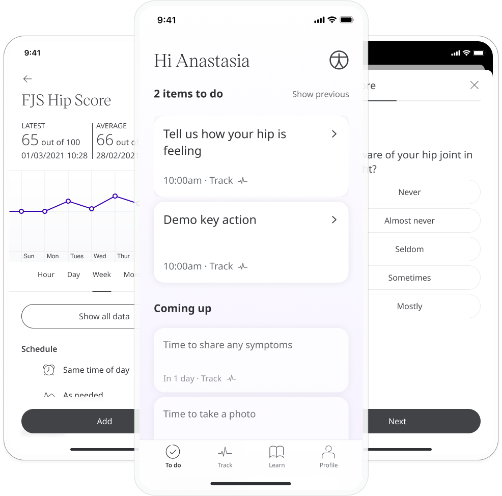
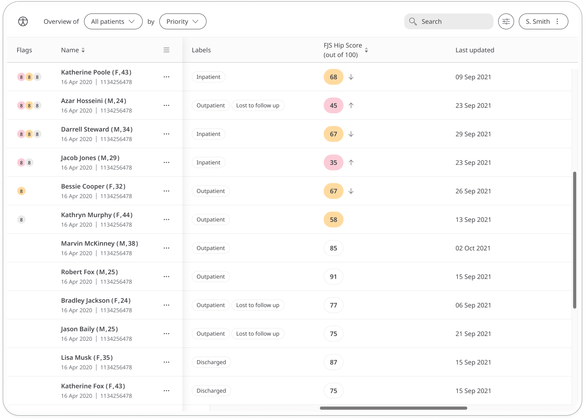
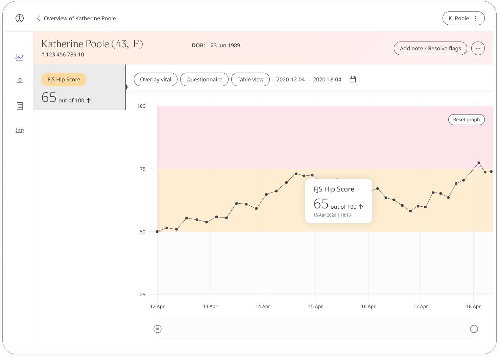

Good hip mobility is key to performing many regular activties, such as walking and standing. People are not generally aware of their joints until there is an issue. The Forgotten Joint Score Hip questionnaire aims to draw a patient's attention to their hip joint in order to help with early diagnosis of issues.

## How it works

Patients answer a number of multiple choice questions about hip joint awareness. At the end of the questionnaire, they are assigned a score which is shared with their care team. To start, patients can select the FJS Hip Score module and click **Add**. From within the module, patients can view their progress in a graph and also access all their previous results. Daily, weekly, or monthly reminders can be set to help stay on track.

In the Huma Portal, care teams will see the latest FJS Hip score for their patient, with concerning scores flagged for attention.

The Patient Summary displays a more detailed view of the patient's historic readings in graph or table form.

