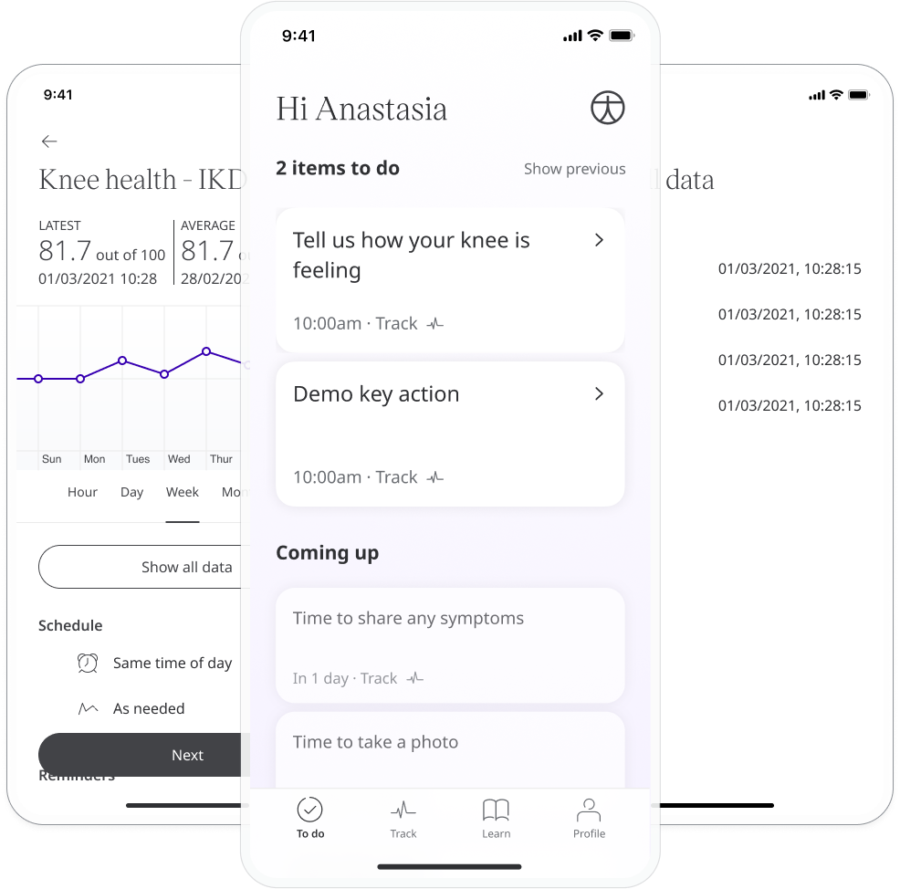
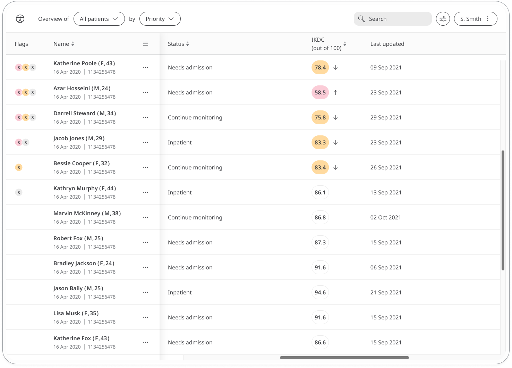
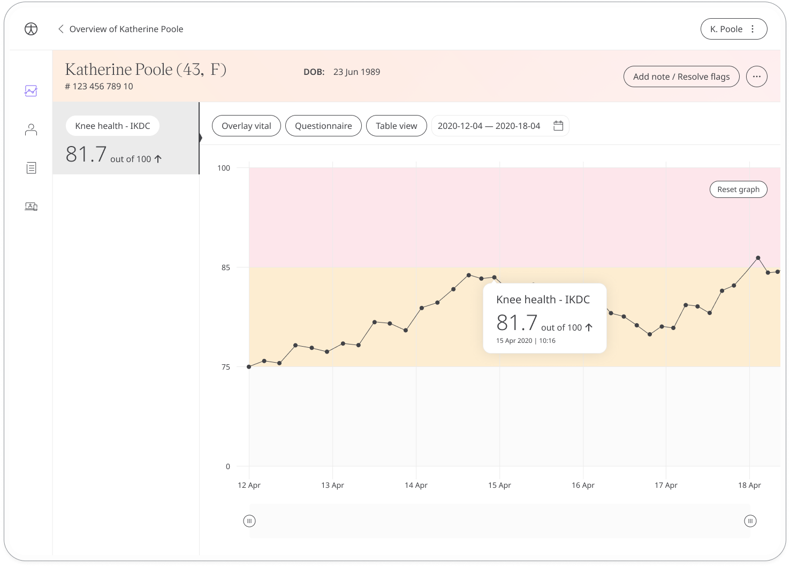

Good knee function is key to performing many regular activties, such as walking and standing. The International Knee Documentation Committee (IKDC) Questionnaire aims to assesses the function of the knee in order to help care teams make assessments about patient care. This questionnaire is available in both English and German.

## How it works

Patients answer a number of subjective questions about knee function divided into 3 categories: symptoms, sports activity, and knee function. The symptoms subscale helps to evaluate things such as pain, stiffness, swelling, and giving-way of the knee. A score is assigned out of 100 which helps care teams to prioritise. 

To start, patients select the Knee Health IKDC module and click **Add**. From within the module, patients can view their progress in a graph and also access all their previous results. Daily, weekly, or monthly reminders can be set to help stay on track.

In the Huma Portal, care teams will see the latest Knee Health IKDC score for their patient, with concerning scores flagged for attention.

In the Patient Summary, care teams can view all historical data in graph or table form.

